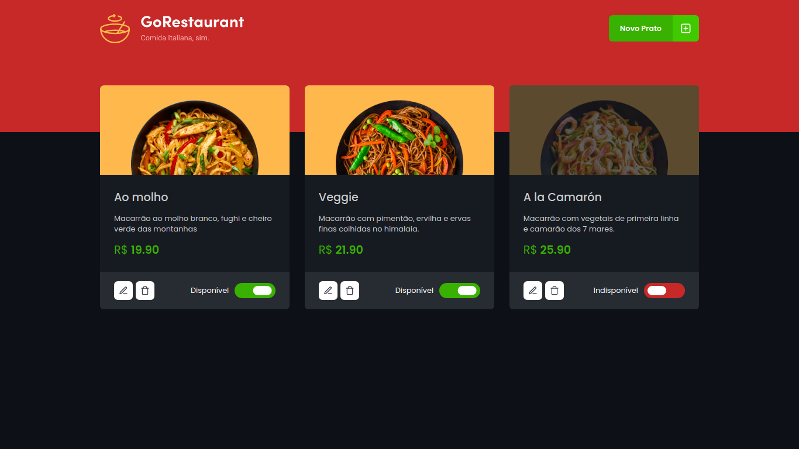

<h3 align="center">
  Desafio 04 - Refactoring de classes e typescript
</h3>

<p align="center">
  <a href="https://rocketseat.com.br">
    
  </a>
  
  <a href="https://www.linkedin.com/in/felipehuffner/">
    
  </a>
</p>

<br>

## :rocket: Sobre o desafio

<p align="center">
  
</p>

Nesse desafio, o objetivo é realizar dois processos de migração: de Javascript para Typescript e de Class Components para Function Components.

Todos os arquivos devem ser migrados de Javascript para Typescript. Além disso, os arquivos que possuírem componentes em classe devem ser migrados para componentes funcionais utilizando hooks.

<br>

## :wrench: Instalação e uso

```bash
# Abra um terminal e copie este repositório com o comando
git clone https://github.com/fhuffner91/gorestaurant
# ou use a opção de download.
# Entre na pasta com 
cd gorestaurant
# Instale as dependências
yarn install
# Inicie a Fake API
yarn server
# Rode a aplicação
yarn start
```

<br>

## :memo: Licença

Esse projeto está sob a licença MIT. Veja o arquivo [LICENSE](/LICENSE) para mais detalhes.

---

Feito com :purple_heart: by [Felipe Huffner](https://github.com/felipehuffner)

[](https://www.linkedin.com/in/felipehuffner/) 
[](mailto:felipeqh.1991@gmail.com)
